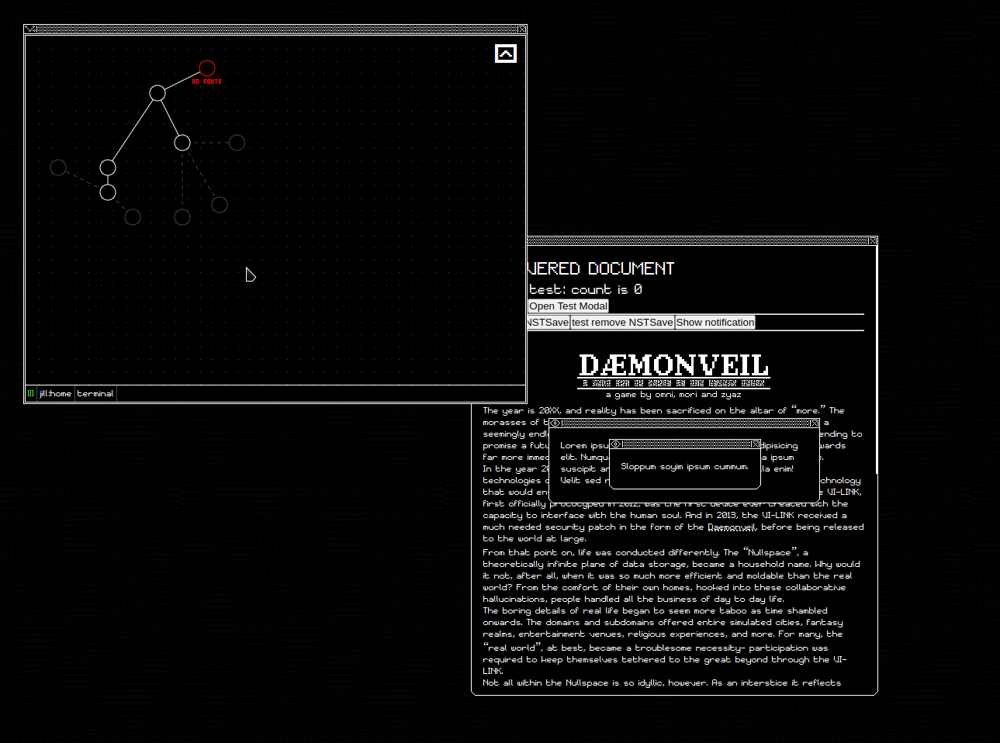

# DÆMONGARDEN

[dæmon.garden](https://daemon.garden/) ~is~ will be a game by [omnidisplay](https://omnipresence.neocities.org) and [moribund](https://rabbitpaths.neocities.org)

Dæmongarden at the moment is still extremely early in development, filled mainly with assorted tests, but it's nice to have a public GH to show our progress :)

Dæmongarden is made using ReactJS and built using Vite.

---
\
Below is a simple gif preview of some of the stuff we've been working on recently.

./


## Code Structure
```
├── assets                      Globally used game assets (fonts, sprites with many uses, ui decorations etc.)
│   ├── fonts
│   ├── images
│   ├── sprites
│   │   ├── characters
│   │   │   ├── full            Full image for dialogue? sequences.  (May be deleted and moved to data.)
│   │   │   └── profile         Headshot images for notifications and contacts.
│   │   └── daemons
│   └── ui
│       ├── common
│       ├── extra
│       └── window
│           └── icons           Small window icons used on their handlebars and taskbar indicator.
|
├── components                  Components organized by their associated major/feature component.
│   ├── Battle
│   │   ├── Battle.tsx          Major component for subfolder (has the same name as folder)
│   │   ├── SigilBuilder.tsx    Subcomponents only used within this feature are grouped here too...
│   │   ├── battle.types.ts     Interfaces for the component's props + any utility variable typing within this feature.
│   │   ├── helpers.ts          (optional) utility functions specific to this feature component.
│   │   ├── battle.config.ts    (optional) exported static configuration constants for this feature
│   │   └── assets              (optional) assets used soley by this feature component.
│   │
│   └── Util                    Recycled Utility Components and "Global" Features, organized the same as /components/
│       ├── Desktop
│       ├── Modal
│       ├── Toasts
│       └── Tooltip
├── data                        Static data for the game, 99% of this data is dynamically imported by a components associated loader function.
│   ├── battles                 Battles, .ts files with a default export of static battle info like enemy name/sprite + functions to initialize their AI.
│   │   └── sprites             
│   ├── defaults                Static initial state for data linked to a store, ie the starting NSMap and Noemata information.
│   ├── dialogue                Dialogue json files. Organized into subfolders based on the games timeline / characters
│   │   └── example
│   ├── hermes                  Hermes generator functions. Dynamically imported functions with the signature () => HermesCollection
│   │   └── ST                  Hermes generator functions specifically initialized by Strophalos.
|   |
│   ├── noemata                 Dynamically loaded Noemata files, organized by their in-game folder counterpart.
│   │   └── kestrel
│   │       ├── someFile.tsx    Noemata files export as a "NoemataData" object, which contains the JSX of how to render them.
│   │       └── assets          Assets, such as images for different Noemata.
│   │   
│   └── scenes                  Scene .ts files for OverlayScene (export of type SceneData[])
│      └── sceneNameAssets          
│                               (Note: many data folders may also have a template.<extension>.txt to copy for writing the needed data format)
│   
├── hooks                       Custom hooks.
├── placeholders                Placeholder/test components, data and files (slated for deletion lateron)
├── stores                      Zustand stores (seperated for persist to work without bundling everything together)
│
├── styles                      Styles are organized in the same way as /components/ to match up components with their associated CSS.                      
│   ├── Battle
│   │   └── Battle.css          Matchup css filenames with component names.
│   │
│   └── Util
│       └── Desktop
│           └── Desktop.css
├── types                       Globally used types throughout the game, often linked to types needed for different game stores.
│   └── npcFlagtypes            Overtly specific, but still universal types (such as the interfaces for NPC flags) are organized into subfolders.
└── util                        Globally used utility functions.
```

## conventions
Follow typical react convention for naming stuff. 

Try to keep imports with the alias'd @ unless working within component folders, then ./ is perfectly fine.

Please use JSDoc when adding complex hooks, components etc.

(Obv) Update this when there's major changes to the structure, convention etc.